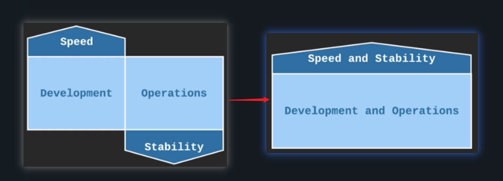

# Chp2-DevOps Culture
## The goals of DevOps:
Collaboration between Dev and Ops.
* Fast time to market (TTM)
* Few production failures
* Immediate recovery from failure

Why DevOps
* Build a robust way to prioritize both speed of delivery and stability
* Automation led to consistency
* Good monitoring, plus the swift development process, ensure problems could be fixed even before uers noticed them

