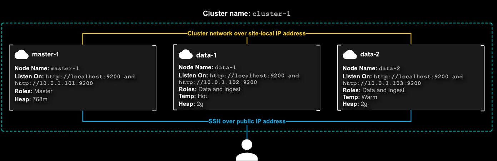

p# Deploy a Multi-Node Elasticsearch Cluster


## Install Elasticsearch on each node

1. Using the Secure Shell (SSH), log in to each node as cloud_user via the public IP address.
Pipe the output of the cURL command into the apt-key program, which adds the public GPG key to APT.
```bash
curl -fsSL https://artifacts.elastic.co/GPG-KEY-elasticsearch | sudo apt-key add -
```
2.  Add the Elastic source list to the sources.list.d directory, where APT will search for new sources:
```bash
echo "deb https://artifacts.elastic.co/packages/7.x/apt stable main" | sudo tee -a /etc/apt/sources.list.d/elastic-7.x.list
```
3. Update your package lists so APT will read the new Elastic source:
```bash
sudo apt update
```
4. Install Elasticsearch with this command:
```bash
sudo apt install elasticsearch
```
Elasticsearch is now installed and ready to be configured.

## Configure each node's elasticsearch.yml
Open the elasticsearch.yml file:
```bash
sudo vim /etc/elasticsearch/elasticsearch.yml
```

### `Master` Node
```bash
#cluster.name: my-application
cluster.name: cluster-1

#node.name: node-1
node.name: master-1

#network.host: 192.168.0.1 - by default it only listen to the local host
#network.host: [ip1, ip2, ip3] - hard code the id address of each node
# below is a much easier and configue friendly way
network.host: [_local_, _site_]

#discovery.seed_hosts: ["host1", "host2"]
# we add the id address of the master node
discovery.seed_hosts: ["172.31.7.48"]

# to bootstrap the cluster
#cluster.initial_master_nodes: ["node-1", "node-2"]
cluster.initial_master_nodes: ["master-1"]

# add node roles
node.master: true
node.data: false
node.ingest: false
node.ml: false
```

### `Data-1`
```bash
#cluster.name: my-application
cluster.name: cluster-1

#node.name: node-1
node.name: data-1

#node.attr.rack: r1
node.attr.temp: hot

#network.host: 192.168.0.1
network.host: [_local_, _site_]

#discovery.seed_hosts: ["host1", "host2"]
# we add the id address of the master node
discovery.seed_hosts: ["172.31.7.48"]

# to bootstrap the cluster
#cluster.initial_master_nodes: ["node-1", "node-2"]
cluster.initial_master_nodes: ["master-1"]

node.master: false
node.data: true
node.ingest: true
node.ml: false
```

### `Data-2`
```bash
#cluster.name: my-application
cluster.name: cluster-1

#node.name: node-1
node.name: data-2

#node.attr.rack: r1
node.attr.temp: warm

#network.host: 192.168.0.1
network.host: [_local_, _site_]

#discovery.seed_hosts: ["host1", "host2"]
# we add the id address of the master node
discovery.seed_hosts: ["172.31.7.48"]

# to bootstrap the cluster
#cluster.initial_master_nodes: ["node-1", "node-2"]
cluster.initial_master_nodes: ["master-1"]

node.master: false
node.data: true
node.ingest: true
node.ml: false
```
## Configure the heap for each node
Open the `jvm.options` file:
```bash
sudo vim /etc/elasticsearch/jvm.options
```

### `Master-1`
```bash
```

## Start Elasticsearch on each node
```bash
sudo systemctl stop elasticsearch
sudo systemctl start elasticsearch
sudo systemctl status elasticsearch

# check the start up process
sudo less +G /var/log/elasticsearch/cluster-1.log

# verify the cluster
curl localhost:9200/_cat/nodes?v
```

## Issue
In case the data nodes failed to join the cluster, after the master node's uuid change. Run these commands on the relevant nodes to save the day
```bash
# stop the es service
sudo systemctl stop elasticsearch

# wipe out the nodes directory where stores information about the cluster state and etc.
sudo rm -r /var/lib/elasticsearch/nodes

# make sure the nodes directory has been wipped out
sudo ls /var/lib/elasticsearch/

# restart the es service
sudo systemctl start elasticsearch

# verify the cluster
curl localhost:9200/_cat/nodes?v
```


## Reference
* [E: Could not get lock /var/lib/dpkg/lock-frontend - open (11: Resource temporarily unavailable) [duplicate]](https://askubuntu.com/questions/1109982/e-could-not-get-lock-var-lib-dpkg-lock-frontend-open-11-resource-temporari)
* [Elasticsearch: failed to validate incoming join request from node](https://stackoverflow.com/questions/62552196/elasticsearch-failed-to-validate-incoming-join-request-from-node/71654831#71654831)