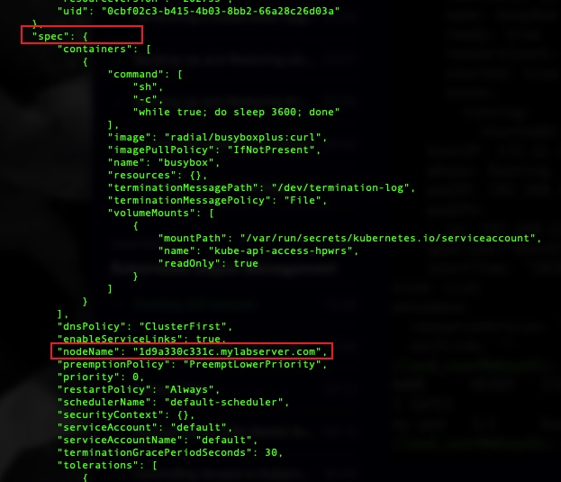
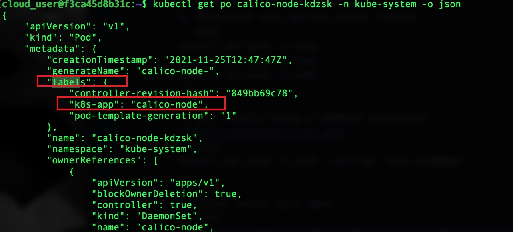

# Exploring a kubernetes cluster using kubectl

1. Create a pod
```yml
apiVersion: v1
kind: Pod
metadata:
  name: my-pod
spec:
  containers:
  - name: busybox
    image: radial/busyboxplus:curl
    command: ['sh', '-c', 'while true; do sleep 3600; done']
```

2.  Use "kubectl api-resources" for a complete list of supported resources.
```bash
kubectl api-resources
```

3. Experiment with various output formats.
```bash
kubectl get pods -o wide
kubectl get pods -o json
kubectl get pods -o yaml
```

4. Sort results using a JSONPath expression

```bash
kubectl get pods -o wide --sort-by .spec.nodeName
```

5. Filter result by a label

```bash
 kubectl get pods -n kube-system --selector k8s-app=calico-node
 ```

 6. Execute a command inside a pod.
 ```bash
 kubectl exec my-pod -c busybox -- echo "Hello, world!"
 ```