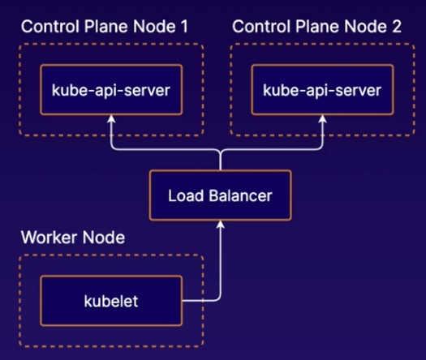
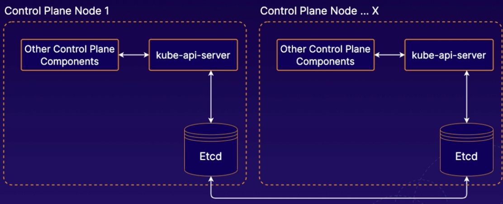
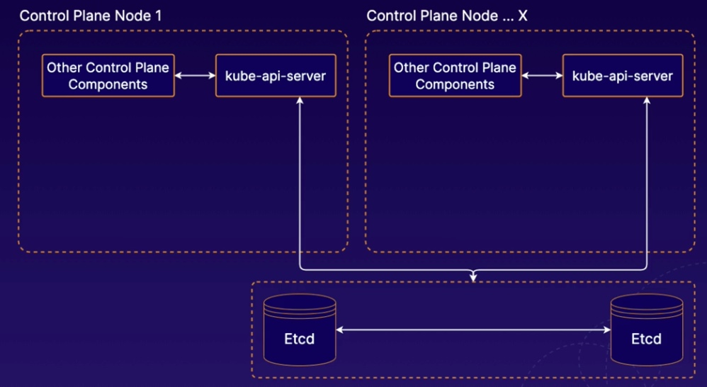

# Cluster Management

## High Availability in K8S
1. Multiple Control nodes
2. Communicate with the kubernetes API via `Load balancer`


## How to manage the etcd instance
1. stacked etcd: deploy etcd on the same node with the rest of control node components

2. external etcd: deploy etcd on a different server


## Safely Draining a K8s Node
1. To remove a kubernetes node from service
```bash
kubectl drain <node name> --ignore-daemonsets
```
2. To add the node back to cluster
```bash
kubectl uncordon <node name>
```

## Upgradeing K8s with kubeadm
### Control Node
1. Upgrade kubeadm on the control plane node
2. Drain the control plane node
3. Plan the upgrade
```bash
kubeadm upgrade plan
```
4. Apply the upgrade
```bash
kubeadm upgrade apply
```
5. Upgrade kubelet and kubectl on the control plane
6. Uncordon the control node

### Worker Node
1. Drain the control plane node
2. Upgrade kubeadm 
3. Upgrade the kubelete configuration
```bash
kubeadm upgrade node
```
5. Upgrade kubelet and kubectl on the control plane
6. Uncordon the worker node

## Backup and Restoring etcd Cluster Data
### Backup
```bash
ETCDCTL_API=3 etcdctl --endpoints $ENDPOINT snapshot save <file name>
```

### Restore
```bash
ETCDCTL_API=3 etcdctl snapshot restore <file name>
```