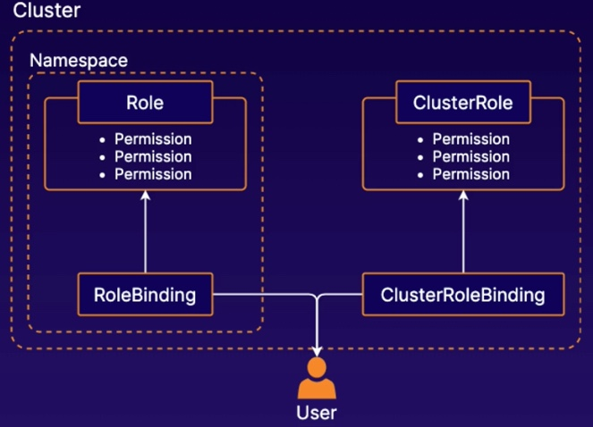

# Kubernetes Object Management

## Working with kubectl
[Exploring a kubernetes cluster using kubectl](www.google.com)

## kubectl tips
* Declarative command: Define objects using ymal or json
* Imperative command: Define object using `kubectl` and flags

[Imperative command](www.google.com)

## Managing K8s Role-Based Access Control (RBAC)
RBAC allows you to control what users are allowed to do and access within your cluster.

For example, you can use RABC to allow developers to read metadata and logs from k8s pods but not make changes.

* `Roles`: defines permissions within a particular namespace
* `ClusterRoles`: defines cluster-wide permessions
* `RoleBinding`: connect users to Roles
* `ClusterRoleBinding`: connet users to ClusterRoles

## Service Account
A service account is an account used by container processes within pods to authenticate with the k8s API

If your pods need to communicate with the k8s API, you can use service accounts to control the access

[Controlling Access in Kubernetes](www.google.com)

## Inspecting pod resource usage
kubernetes metrics server: an add-on to collect and provide metrics about the resources pods and containers are using.

After installing the add-on, we can uss `kubectl top` to view the metrics