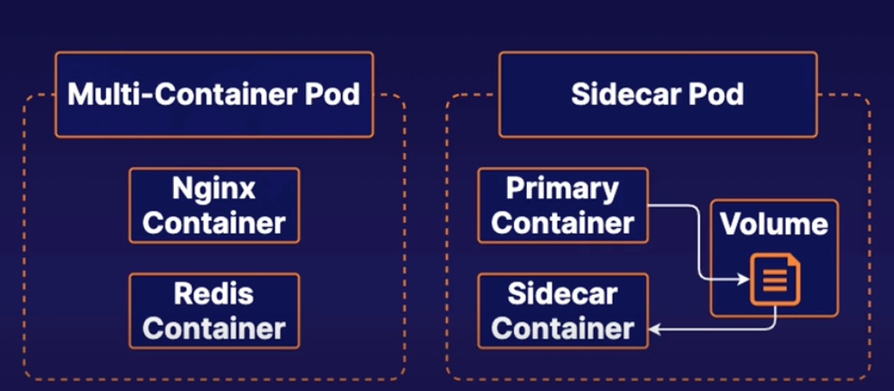

# Practice Exam 9 - Multi-container Pods

## Create a Multi-Container Pod
```yml
# sudo vi multi.yml
apiVersion: v1
kind: Pod
metadata:
  name: multi
  namespace: baz
spec:
  containers:
  - name: nginx
    image: nginx
    ports:
    - containerPort: 80
  - name: redis
    image: redis
```

## Create a Pod Which Uses a Sidecar to Expose the Main Container's Log File to `stdout`
```yml
# sudo vim logging-sidecar.yml
apiVersion: v1
kind: Pod
metadata:
  name: logging-sidecar
  namespace: baz
spec:
  containers:
  - name: busybox
    image: busybox
    args:
    - /bin/sh
    - -c
    - >
      i=0;
      while true;
      do
        echo "$i: $(date)" >> /var/log/1.log;
        echo "$(date) INFO $i" >> /var/log/2.log;
        i=$((i+1));
        sleep 1;
      done   
    volumeMounts:
    - name: sharedvol
      mountPath: /var/log/
  - name: sidecar
    image: busybox
    command: ['sh', '-c', 'tail -f /logs/1.log']
    volumeMounts:
    - name: sharedvol
      mountPath: /logs
  volumes:
    - name: sharedvol
      emptyDir: {}
```