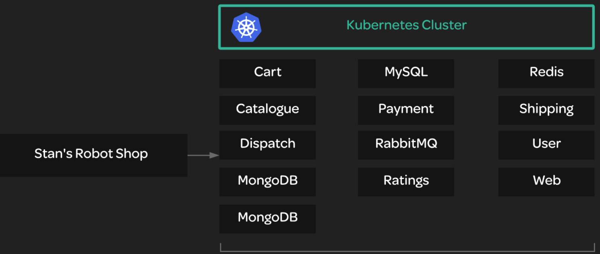

# Deploying a Microservice Application to Kubernetes

## You will need to do the following:
* Deploy the Stan's Robot Shop app to the cluster.
* Scale up the MongoDB service to two replicas instead of just one.

## Deploy the Stan's Robot Shop app to the cluster.
Clone the Git repo that contains the pre-made descriptors:
```bash
cd ~/
git clone https://github.com/linuxacademy/robot-shop.git
```

Since this application has many components, it is a good idea to create a separate namespace for the app:
```bash
kubectl create namespace robot-shop
```



Deploy the app to the cluster:
```bash
# create all yml file in one go
kubectl -n robot-shop create -f ~/robot-shop/K8s/descriptors/

# watch the status change of pods
kubectl get pods -n robot-shop -w
```


You should be able to reach the robot shop app from your browser using the Kube master node's public IP: http://$kube_master_public_ip:30080

## Scale up the MongoDB service to two replicas instead of just one.
Edit the deployment descriptor:
```bash
kubectl edit deployment mongodb -n robot-shop
```

You should see some YAML describing the deployment object.
* Under spec:, look for the line that says replicas: 1 and change it to replicas: 2.
* Save and exit.

Check the status of the deployment with:
```bash
kubectl get deployment mongodb -n robot-shop
```
After a few moments, the number of available replicas should be 2.