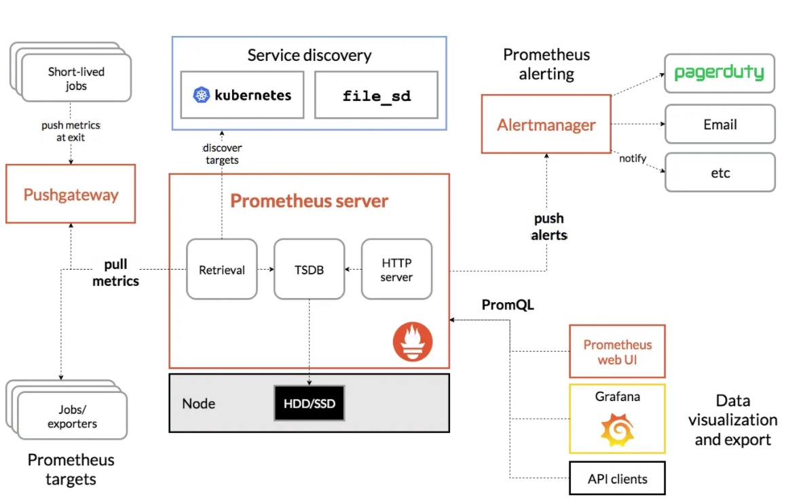
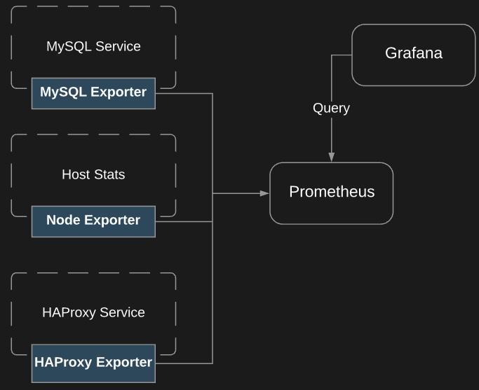
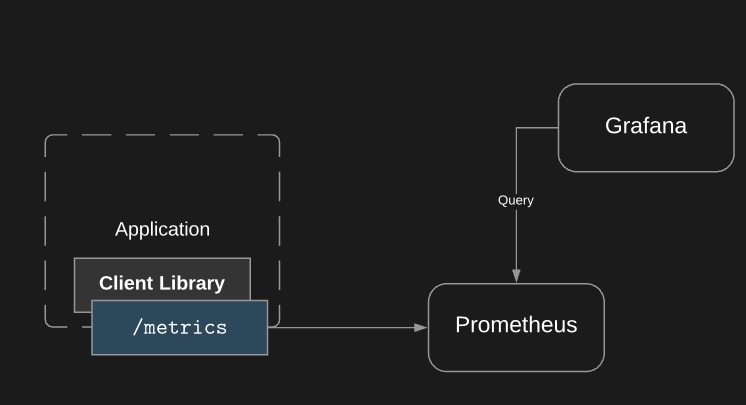
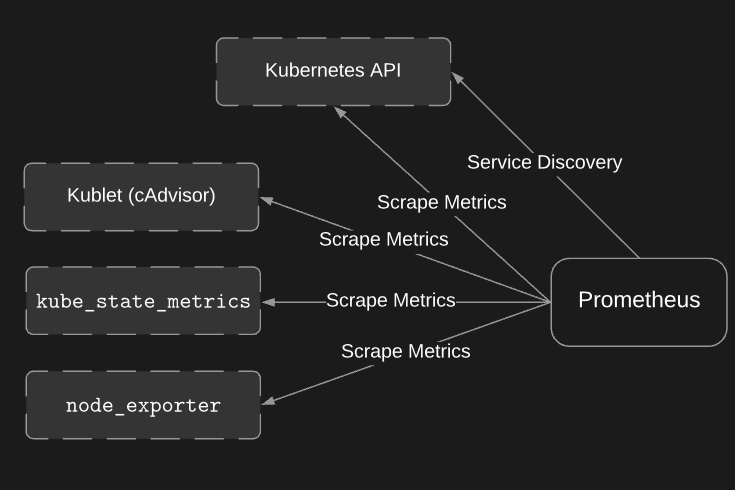

# Prometheus Basic
## High-Level Use Cases
* `Metric Collection`: collect important metrics about your system and applications in one place
* `Visualization`: build dashboard that provide an overview of the health of your system
* `Alerting`: receive a notification when something is broken

##  Prometheus Architecture

Main components:
* `Prometheus server`: a central server that gather metrics and makes them available
* `Exporters`: agents that expose data about systems and applications for collection by the prometheus server

* `Client Libraries`: easily turn your custom application into an exporter that exposes metrics in a format prometheus can consume

* `Prometheus Pushgateway`: allow pushing metrics to prometheus for certain specific use cases
* `Alertmanager`: sends alerts triggered by metric data
* `Visualization Tools`: view the metric data

Pull Model:
* prometheus server pulls metric data from exporters
* agents go not push data to the prometheus server


## Client Library
The client library sits in the application. 

The client libaray go and gather the metrics on your applcation and format them to what prometheus can understand


## Service Discovery


How does prometheus access to the metrics of the application? we can 
* define the target in prometheus configuration
* use service discovery

## Configuring Prometheus
To view the prometheus.yml
```bash
#curl <host ip>:<port>/api/v1/status/config
curl 10.223.90.111:30090/api/v1/status/config
```

## Exporters

## Reference
[How to Setup Prometheus Monitoring On Kubernetes Cluster](https://devopscube.com/setup-prometheus-monitoring-on-kubernetes/)
