# Enterorise Architecture

## Enterorise Architecture Design Consideration
### Tier 2 vs Tier 3 designs
Triditional Three-Tier Architecture
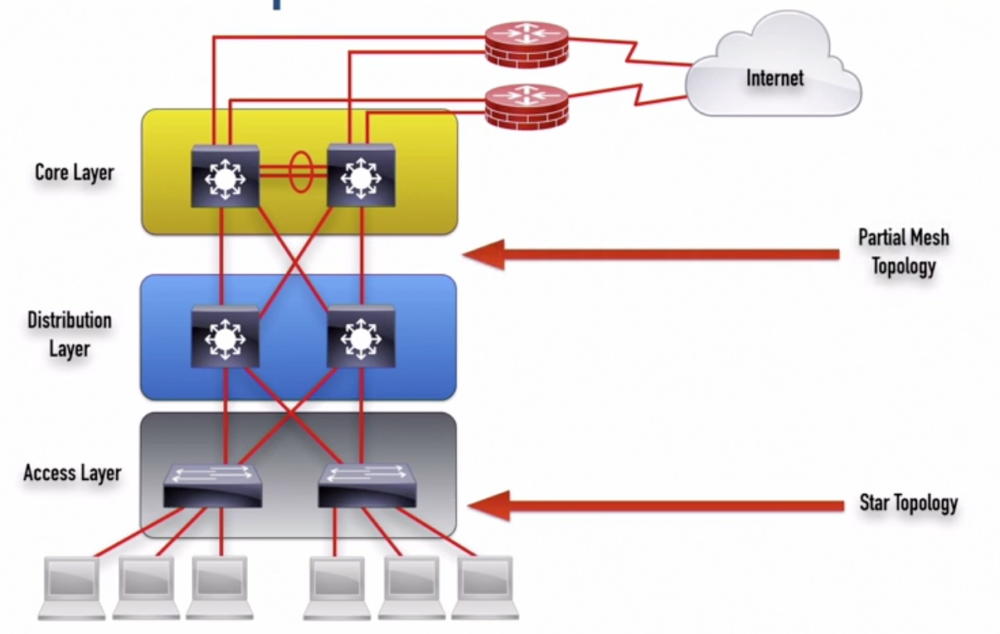

Collasped Core Two-Tier Architecture x
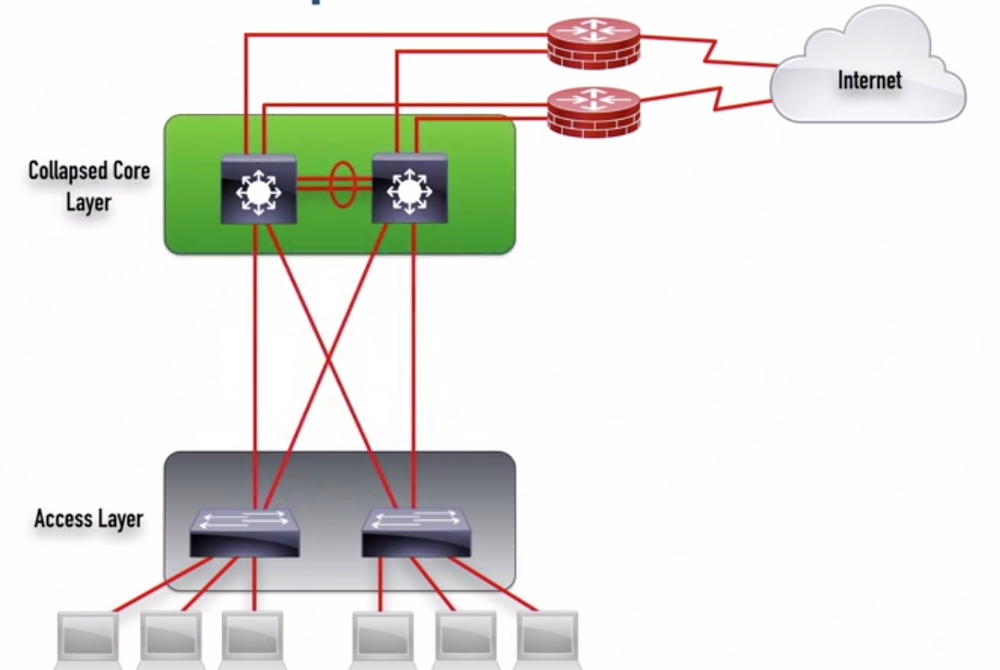
* consolide distribution and core layers
* apply to small building

Spine-Leaf Two-Tire Architecture
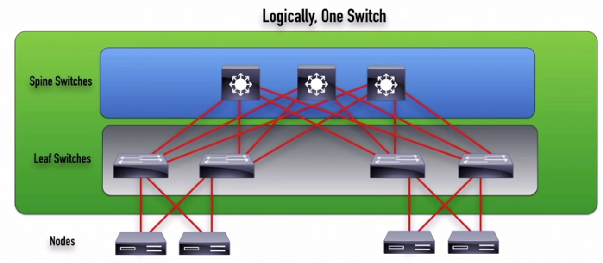
* commonly used in data ceters
* every leaf switch connectes to every spine switch
* logically, it is one switch

### On-premise vs Cloud designs
To secure the data:
* VPN
* Private WAN (MPLS, Metro Ethernet)
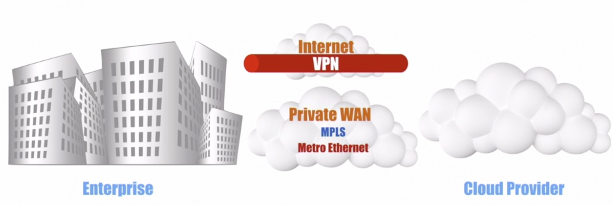

### Fabric Capacity Planning
Fabric: a network inter-connection inside a data center
* How much data do we need to push through a dc switch
* How much data can we push through a specific hardware
* What is the antipacited bw demand increase over time

### Redundant Design
* SLA: Service Level Aggrement
* RTO: Recovery Time Objective
* RPO: Recovery Point Objective
* MTBF: Mean Time Between Failures
* MTTR: Mean Time To Repair

### First hop redundancy protocols: FHRPs
1. HSRP: Hot Standby Router Protocol: 
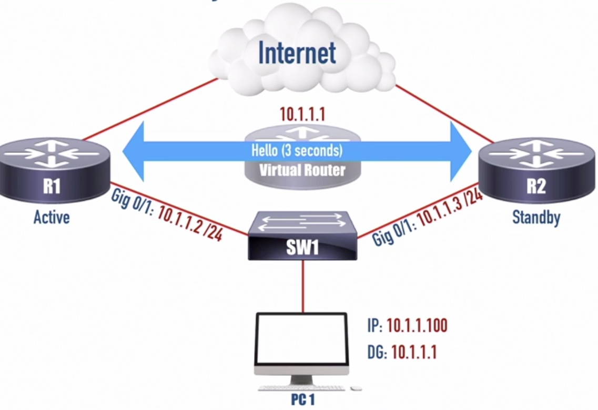
* Deploy a virtual router (10.1.1.1) which will never go away
* Point PC to 10.1.1.1 as the default gateway, other than poting to either 10.1.1.2 (R1) or 10.1.1.3 (R2) which could act as a single point failur
* We can make R1 as active HSRP router serving the virtual router
* As a standby router, R2 will be take over if it does not hear from R1 for more than 10s.

2. VRRP: Virtual Router Redundancy Protocol
* The physical interface of router can be the virtual router
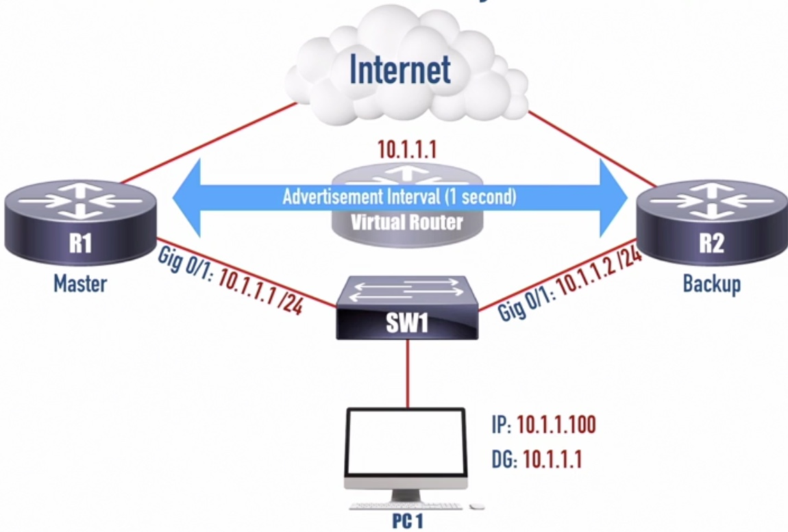

3. GLBP: Gateway Load Balancing Protocol
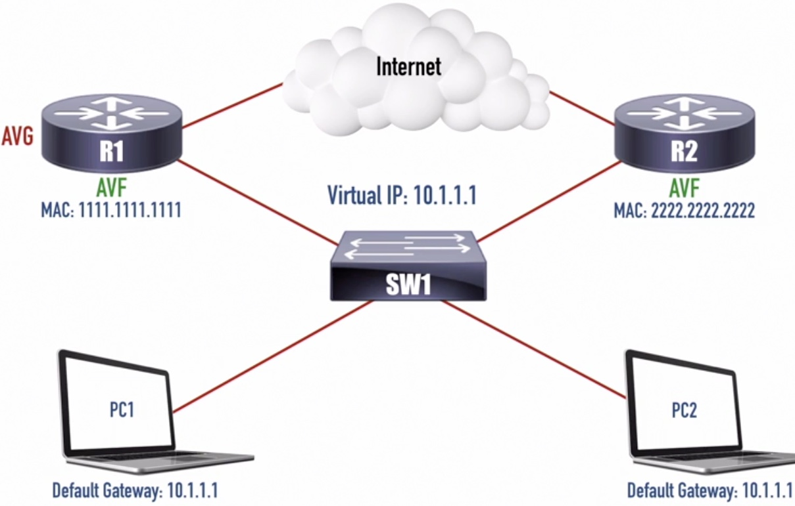
* AVG responds to ARP queries by sending R1 or R2's MAC address to PC
* You can have maximum of 4 routers in a GLBP group
* Load Balancing:
    * Round-Ronbin (default)
    * Host-Dependent
    * Weighted

## Wireless Deployment Options
1. Autonmous Access Point
* Standalone (the APs are configured on a one-by-one basis)
* Home or small office, Not suitable for enterprise network
* Controller-less. Acceable via management IP

2. Lightweight Access Point
* Controller based. 
* Requires central wireless LAN Controller(WLC), which can be physical or virtual
* The controller will communicates and manage APs via CAPWAP (controller and provisoning of wireless access point)tunnels

## SD-WAN Technology
1. Traditional WAN setup need Traffic backhauling, which allow all traffic go from the branch to the main side)
2. By leveraging cloud technology, SD-WAN no longer require traffic backhaul.
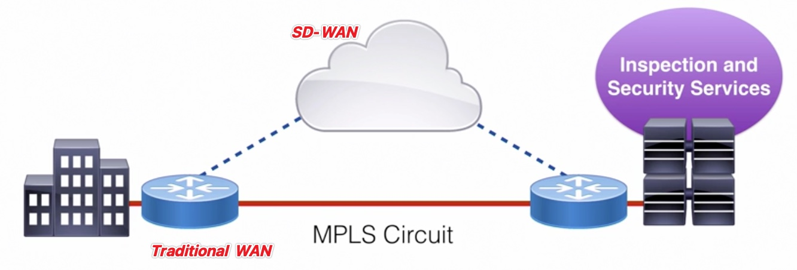
3. Underlay and Overlay Network
*  Overlay network is a virtual network built on top of underlay network
* SD-WAN is overlay network which provides transport independent.
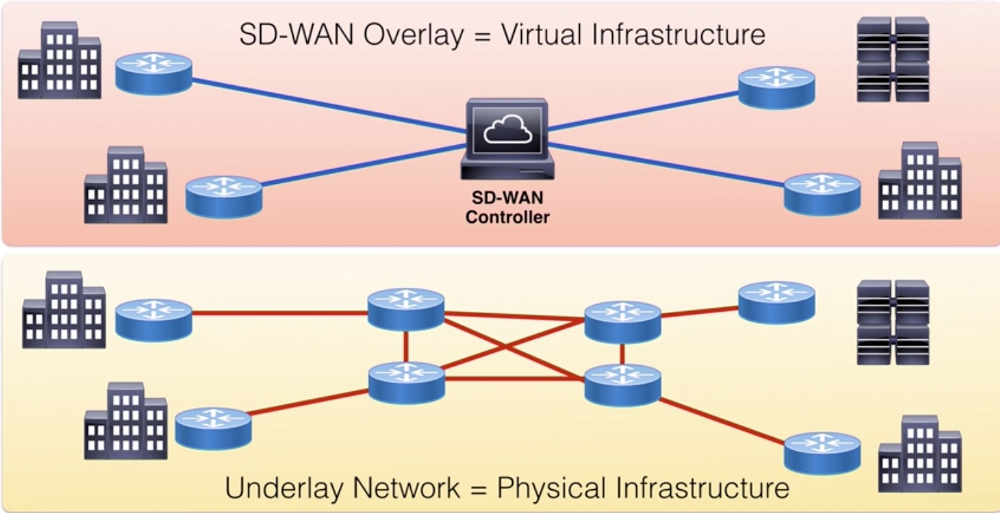

## SD-WAN Implementation
1. Main components
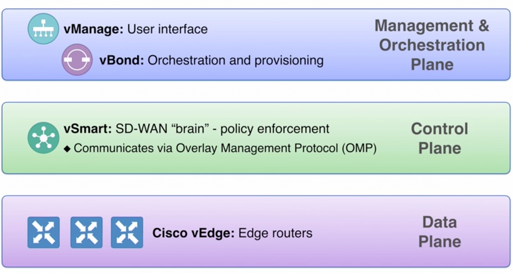
2. An overlay network
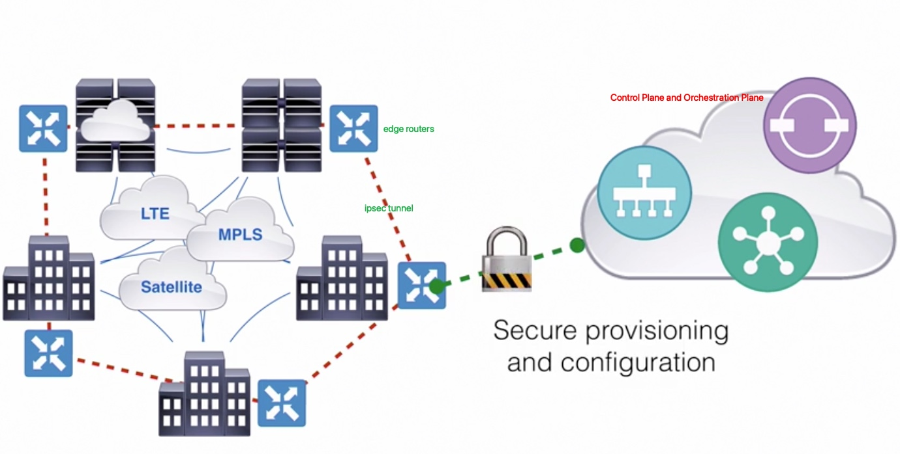
3. Edge Routerts Hardware
* Cisco vEdge routers
* ISR (Integrated Services Routers) 1000 and 4000 series
* ASR (Aggregation Service Routers) 1000 series
4. Edge Router Software Platform
* CSR 1000v router
* vEdge Cloud Router

## Review of QoS mechanisms
1. When do we need QoS:
* Speed Mismatch
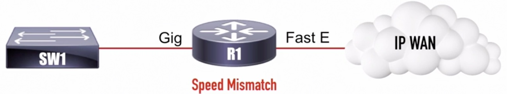
* Aggregration Point
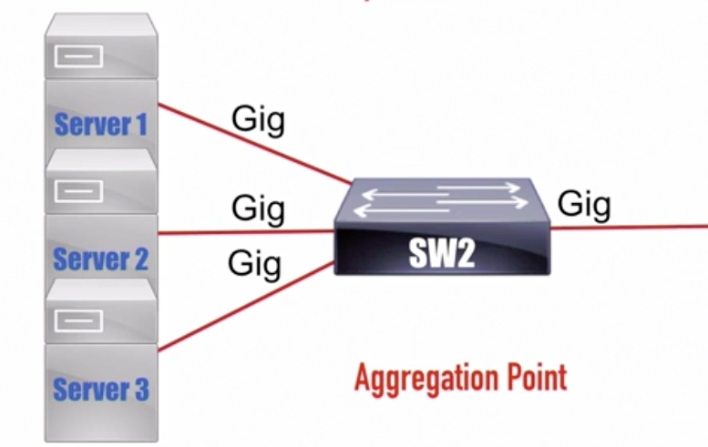
2. 3 categories of QoS
* Best Effort - Not Strict
* DiffServ - Less Strict
* IntServ - Strict

## Switching Mechanisms
1. Process Switching
* Processor is directly involved with every packet
* Not ideal in modern network
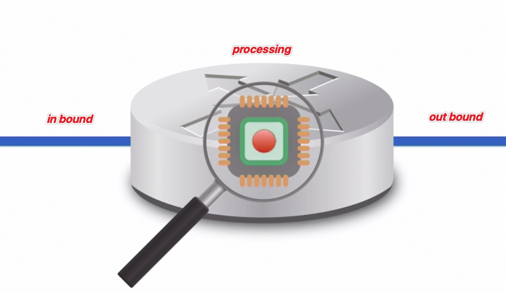
2. Cisco Express Forwarding (CEF)

## FIB vs RIB
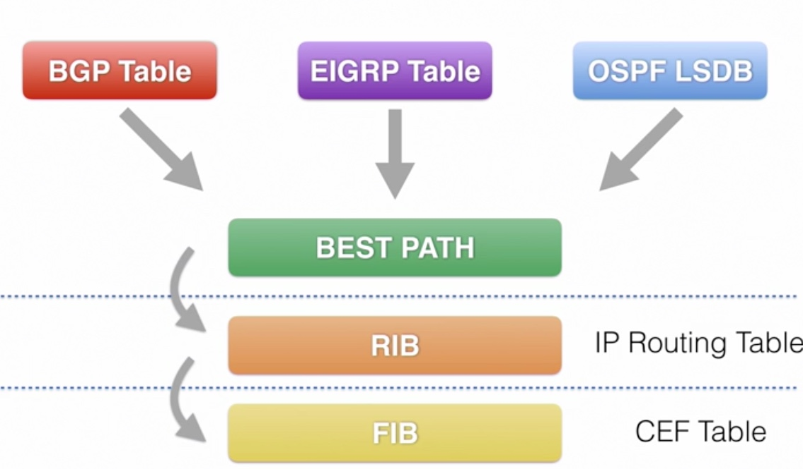
FIB: Forwarding Information Base.

RIB: Routing Information Base. 

Q: Why don't we use RIB for packet forwarding?
A: Some the entries containt in RIB may have next hop addresses which are not directly connected. FIB contains a copy of route found in the RIB. FIB will acknology layer2 data to resolve the next hop addressing.