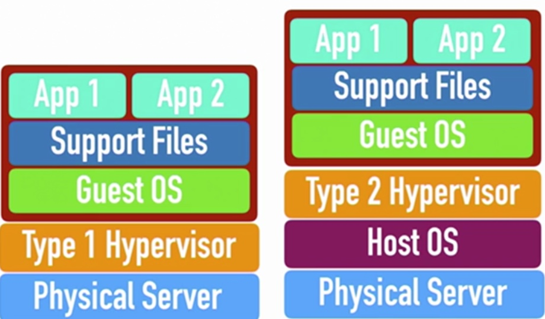
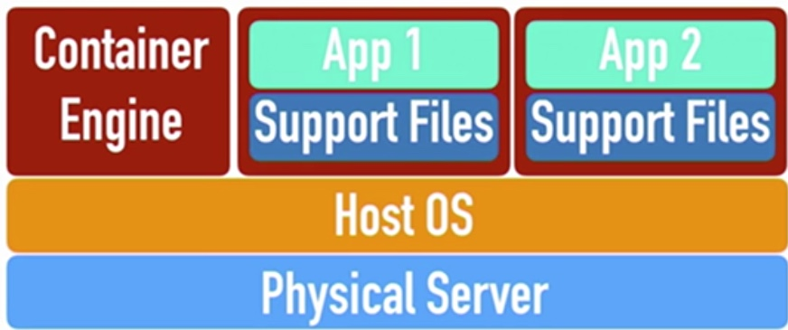
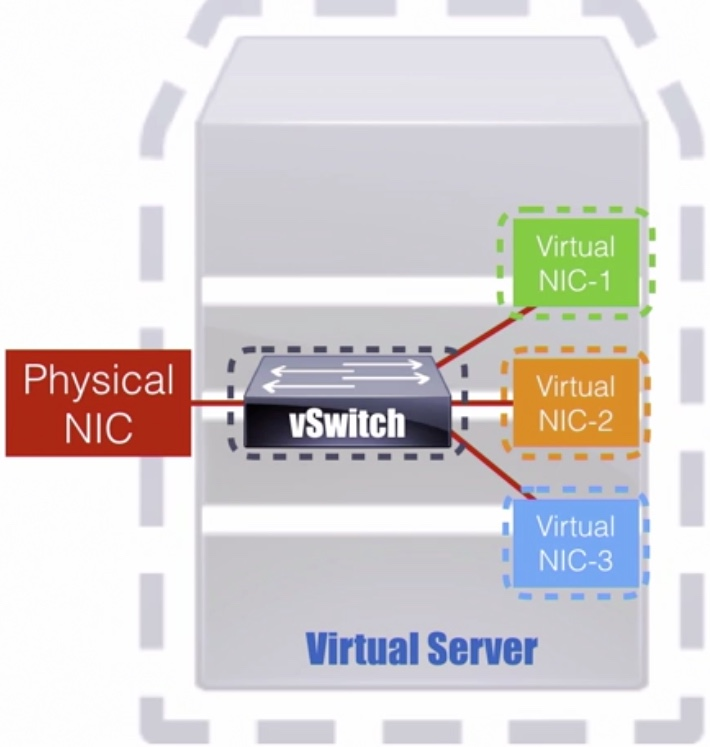
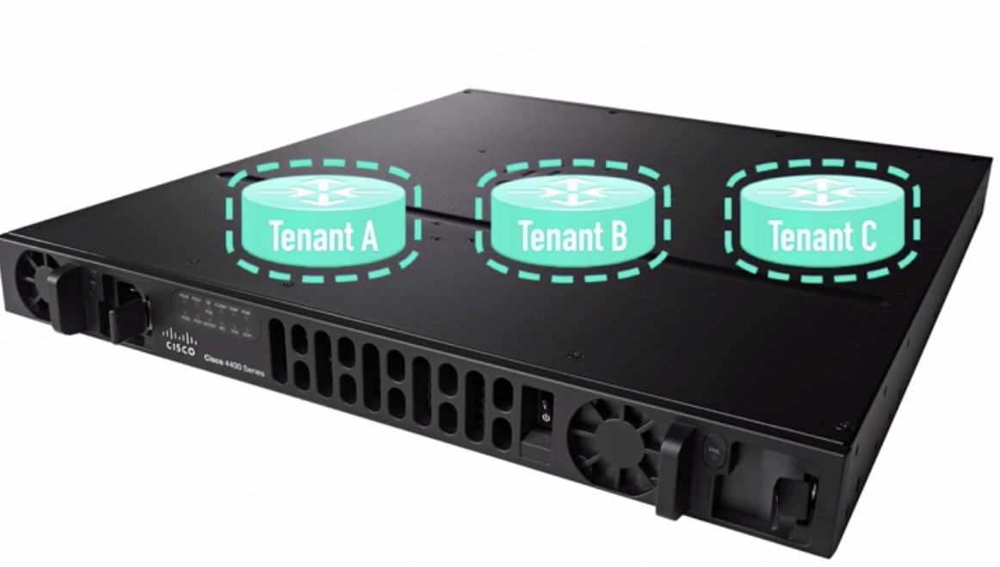
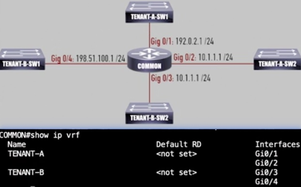
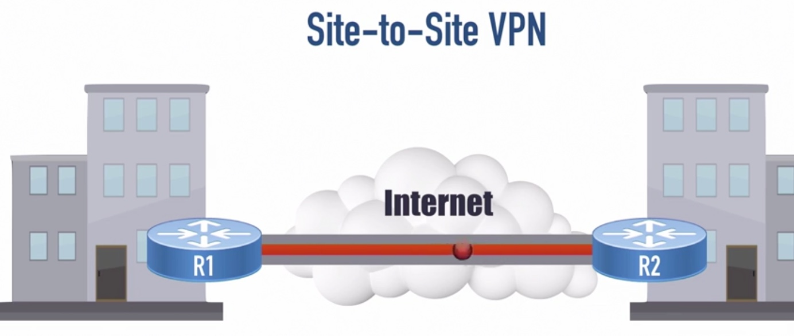
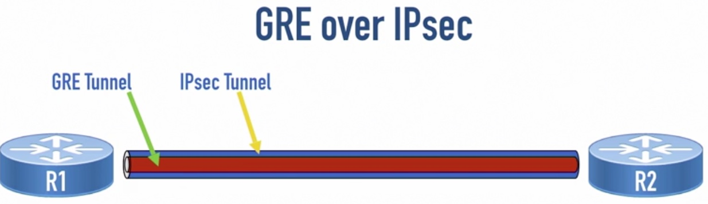
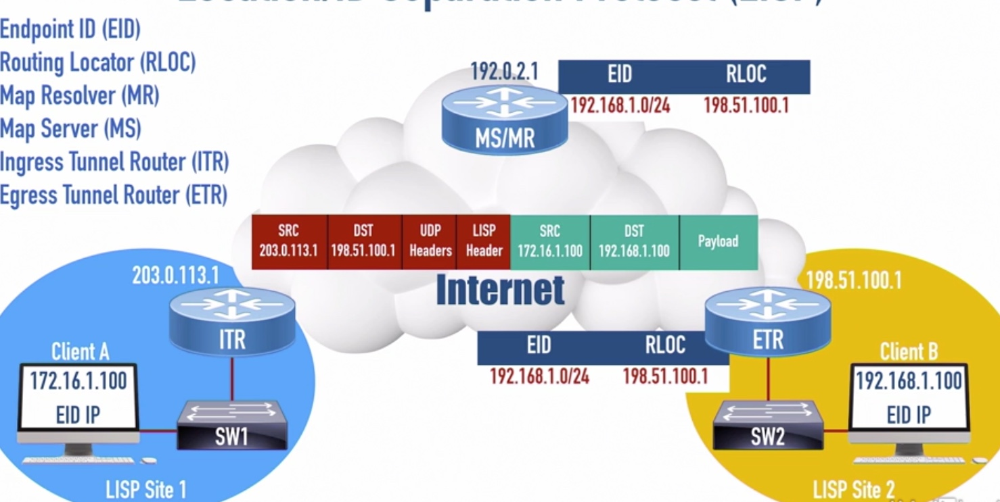

# Enterorise Architecture

## Virtualize Technologies

### Hypervisor 
Hypervisor is a software that can create, start, stop and monitor multiple virtual machines
* Type 1: Native or Bare Metal, run directly on the server's hardware
* Type 2: Hosted: run in a OS

Containers

### Virtual Switch
The the software in virtual machine need to connect to Internet via virtual NIC.

A victual switch can connect virtual NIC to a physical NIC

## Data path virtualization

### VRF: Virtual Routing and Forwarding
Create virtual routers for different tenants, which isolated routing tables

### VPN

|VPN Protocol|Security|Encapsulation|Mode|
|------------|---------|------------|-----|
|GRE: Generic Routing Encapsulation|No|Nearly any type of data|N/A|
|IPsec|Super secure|unicast IP packets only|Transport/Tunnel Mode|

Combine two VPN protocol together:
* GRE encapsulates nearly any traffic type into GRE packets, which are unicast IP packets
* The GRE packet are protected over IPsec tunnel.

## Network virtualization
### Location ID separation Protocol (LISP)
LISP helps to resolve the problem with scalability with the internet routing table

* LISP separates a single IP address into two parts
    1. EID: endpoint identifier
    2. RLOC: Routing Locator  

* The router in LISP site register its information with a `Map Server`
* `Map Resolver` knows about the current RLOC for a EID

