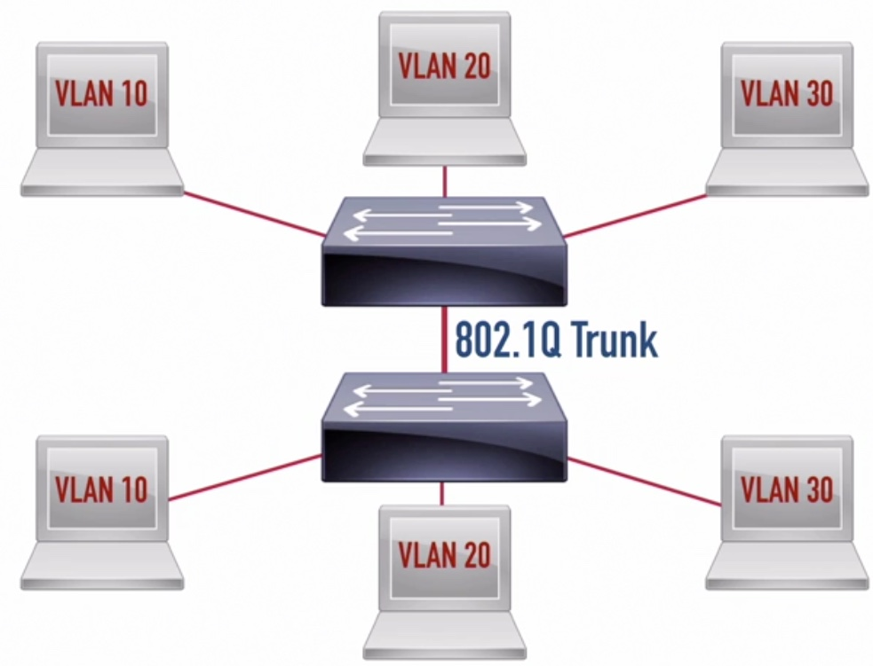
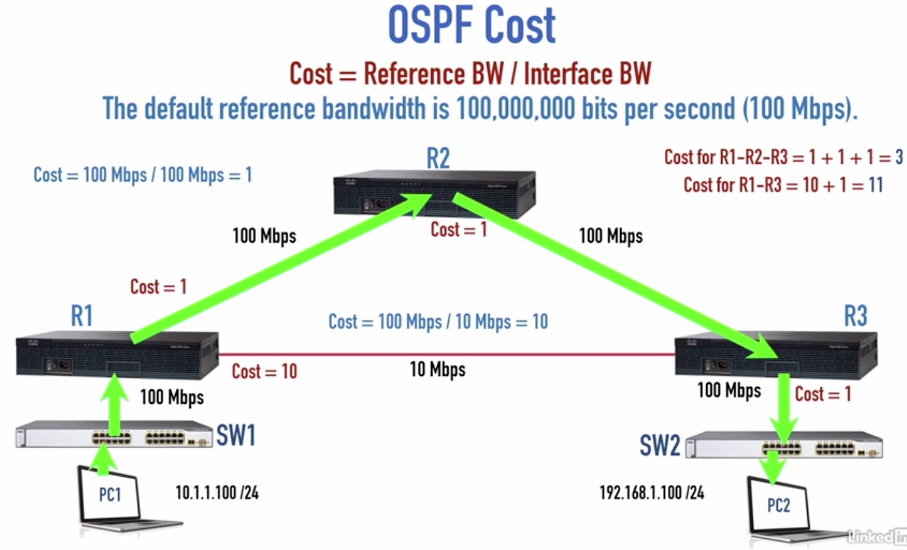
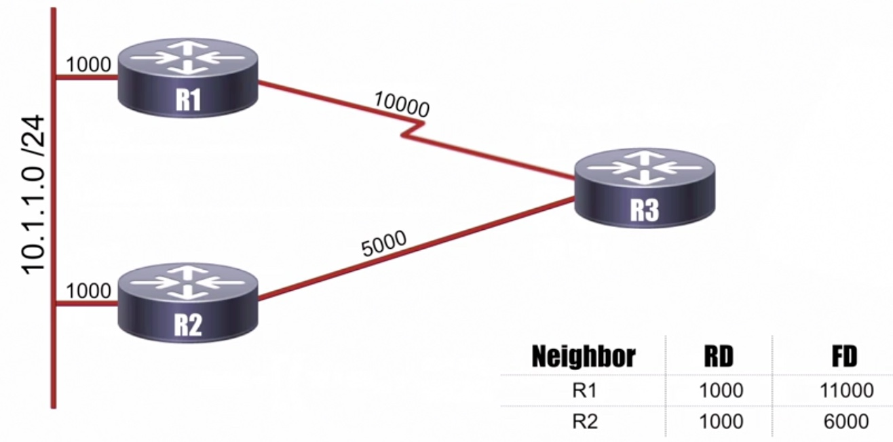
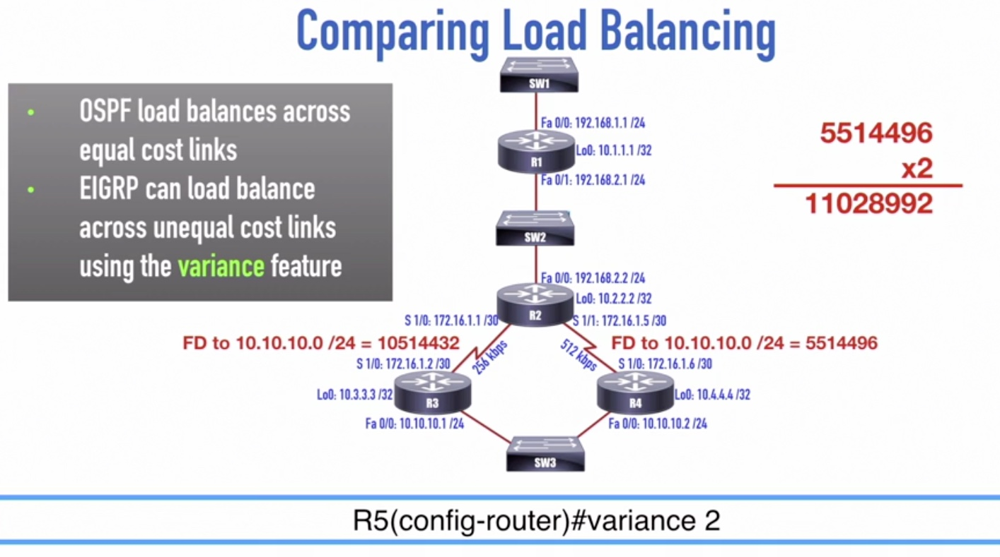
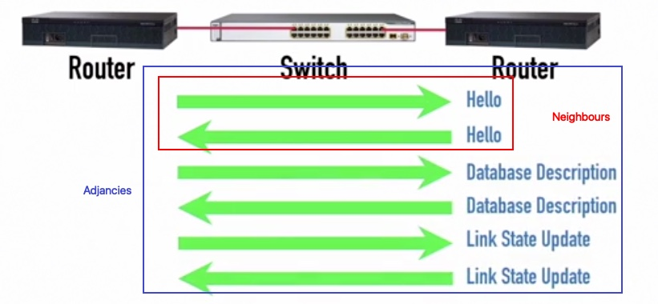
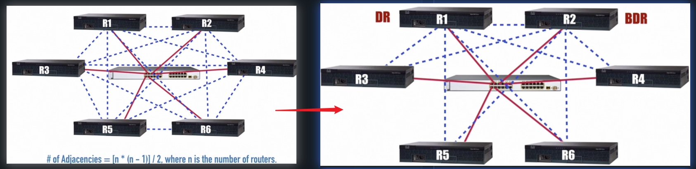

# Infrastructure Technologies.

## L2 Infrastructure technologies

IEEE 802.1Q Trunk

## OSPF
### Routing Protocol Comparison
|Routing Protocol|Distance-Vector|Link-State|Path-Vector|
|--|---|--|---|
RIP|Y|
OSPF||Y|
IS-IS||Y|
EIGRP|Y|
BGP|||Y|

Administrative Distance: Lower distance, the more believable
|Routing Source|Administrative Distance|
|--|--
Connected|0|
|Static|1|
EIGRP|90|
OSPF|110|
RIP|120|

OSPF Cost

EIGRP Metric Calculation
**Big Dog Really Likes Me**
* B: bandwidth
* D: delay
* R: reliability
* L: load
* M: mtu

EIGRP Path Selection, reported distance and feasible distance

Comparing Load Balancing:
* OSPF only consider cost, so the traffic will always goes to R2-R4
* EIGRP can apply variance on unequal cost link

### OSPF neighbour formation
Neighbourship vs Adjacencies
Neighbours are routers that:
* Reside on the same network link
* Exchange hello message

Adjacensices are router that:
* Are neighbours
Exchange LSU(Link State Updates) and DD (Database Description) packets

The need for designated routers: we don't need make each router as adjacensice of each other.
* DR: designated router
* BDR: backup designated router

We use multicast address to talk to all DR
* 224.0.0.5 or FF02::5 - All OSPF routers
* 224.0.0.6 or FF02::6 - All designated routers

DR and BDR Election:
* Highest Router Priority Wins
* Higest Router ID Wins